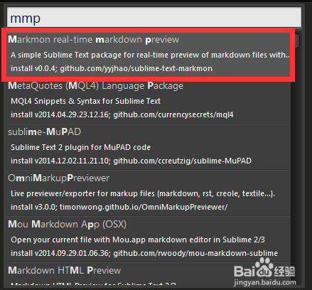
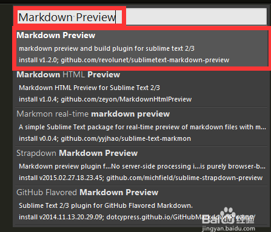
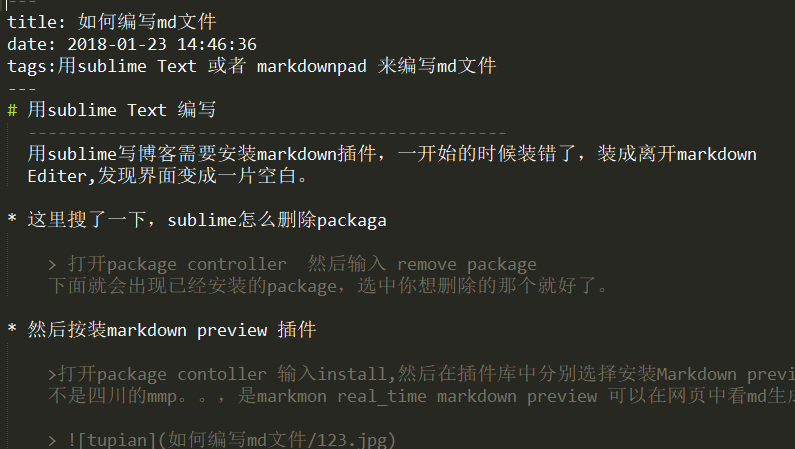
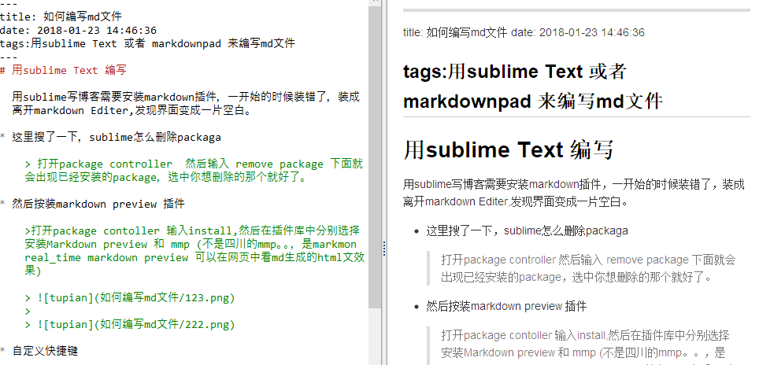

# 用sublime Text 编写

  用sublime写博客需要安装markdown插件，一开始的时候装错了，装成离开markdown Editer,发现界面变成一片空白。

* 这里搜了一下，sublime怎么删除packaga

    > 打开package controller  然后输入 remove package 下面就会出现已经安装的package，选中你想删除的那个就好了。

* 然后按装markdown preview 插件
    
    >打开package contoller 输入install,然后在插件库中分别选择安装Markdown preview 和 mmp (不是四川的mmp。。，是markmon real_time markdown preview 可以在网页中看md生成的html文效果)
     
    > 
    >  
    > 

* 自定义快捷键
   
    >直接preferences->key bindinds 在右边输入
    >{ "keys": ["alt+m"], "command": "markdown_preview", "args": {"target": "browser", "parser":"markdown"} },

    >保存后直接输入ALT+M就能预览了，但是由于，图片我是放在本地的所以看不到。
 
* 不足

    >1.首先，我发现md hightlight简直了。。。就下划线变了个色，装了插件和没装一个样
    >
    >

    >2.其次，每次alt+m简直累，只能是在没有更好的编辑器的时候再用。

--------------------------------------------------
# 用markdownpad2编写

   之前看到说markdownpad是window系统下最好用的编辑md文件的软件，昨天装的时候报了个错，而且右边也没有实时显示出页面，所以才会有上面的用sublime来编辑，今天百度了一下错误，安装了一个软件后果断解决，而且十分好用

   >安装markdownpad2

   >安装awesomiumSDK 安装包都在我的百度云盘里
   >链接：[https://pan.baidu.com/s/1kWhWHqJ](https://pan.baidu.com/s/1kWhWHqJ) 密码：9swy
   >效果图

   >

-----------------------------------------------------
# 图片存储问题

顺便记录一下图片存储的问题吧，我在第一次写博客的时候找到的攻略
   >1.首先确认_config.yml 中有 post_asset_folder:true
   >
   >2.在hexo的目录下执行npm install https://github.com/CodeFalling/hexo-asset-image --save（需要等待一段时间）
   >
   >3.完成安装后用hexo新建文章的时候会发现_posts目录下面会多出一个和文章名字一样的文件夹。图片就可以放在文件夹下面
   >只要使用 `` 就可以插入图片。
   >
   >记得PNG要大写，不要问我怎么知道的
   